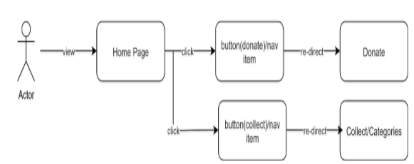

# Donation Website Software requirements

## Goals
1. Giving users the ability to donate: food, and clothes easily.
2.  pick food, clothes for the homeless easily using geolocations.
3. Offer a place to Stay over. 

## User Stories
1. As a donor, I want to see a form in which I can enter the type of donation, my information, my current location.
2. As a viewer, I want to view individual categories for each type of donation.
3. As a user, I have the ability to pick a portion of food, clothes and a place to stay over from the website storage.

## User Flow

## Business Requirements
* Pages
   *  Home Page
      *  Navigation Bar: logo, name. Tabs
       * Section1: image, quote, button(learn more)
       * Section 2: What we do 
       * Section 3(our causes): 3 images/ cards with text and button redirect to donate page
      * about us/ meet our team section
      * footer: contact info, social tabs 
    * Donate
      * same layout for home nav/ footer
      * Dynamic form

    * Categories page
      * same layout nav/footer 
      * sections for: food, clothes, shelter, reserved.

## Technical Requirements
* Front End using JavaScript
   * constructors.
   * local-storage.
* HTML geolocation API. **
  * scroll effects.
* Front End using Css
  * Animation
   * Flexbox
* Front End with Html 
  * Forms
  * Semantics
  * Buttons

## Wireframe
[Wireframe](https://miro.com/app/board/o9J_lVoQWrI=/)
